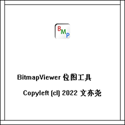

# BitmapViewer 位图工具

BitmapViewer（BV）是一个使用 C 语言开发的位图查看、处理工具，GUI 使用 Win32 GDI 开发，仅支持 Windows 平台运行。BV 不是一个[图像创作、编辑工具](#2D图形创意软件)，仅支持简单的图像编辑功能（如裁剪、填充等）;BV作为一个图像处理工具，主要提供了[灰度变换](#灰度变换)、[空域滤波](#空域滤波)、[频域滤波](#频域滤波)、[多图操作](#多图操作)等功能。

## 灰度变换

1. 提取彩色图灰度值（经验公式、伽马校正）
2. 单像素变换（取反、对数、伽马）
3. 直方图处理（均衡化、规定化）

## 空域滤波

1. 模糊卷积核（盒式、高斯）
2. 锐化卷积核（拉普拉斯、索贝尔）
3. 非线性滤波（中值）

## 频域滤波

1. 功率谱提取（DFT、FFT）
2. 相位谱提取（DFT、FFT）
3. 传递函数处理（陷波、提升、同态滤波）

## 多图操作

1. 算数运算（+，-，×，÷）
2. 频谱重建图像（指定功率谱、相位谱）

## 2D图形创意软件

Adobe Photoshop（全能）、Adobe Illustrator（矢量绘图）、Blender（开源3D）、Clip Studio（漫画）、Krita（KDE开源）、Aseprite（像素画）、Adobe Animate（帧动画）、Spine（骨骼动画）、Sib Icon Studio（图标制作）……
